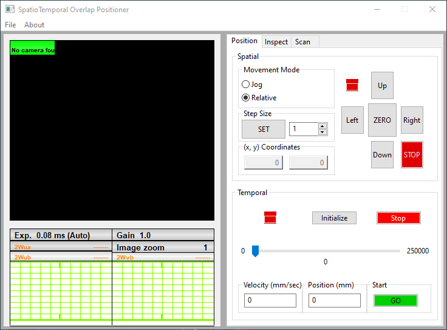

# Spatiotemporal Overlap Positioner

This is the unfinished skeleton of a program meant to interface a Dataray CMOS camera with both a micrometer stange and piezo-electric mirror stage. I chose to do this as a quality-of-life improvement in the lab, as well as to help improve my understanding of object-oriented programming. 

**This project is on an indefinite hold.**

